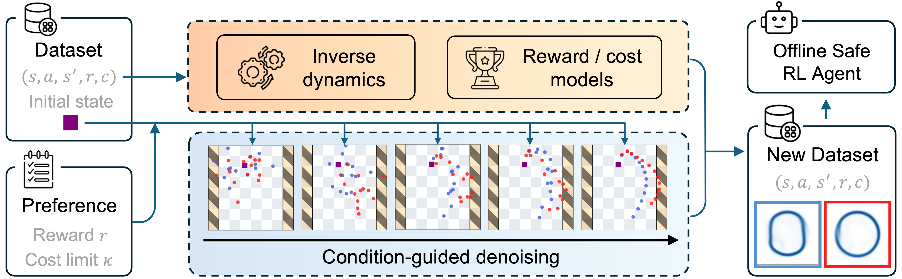

<h1 align="center">

<br>
OASIS: Conditional Distribution Shaping for Offline Safe Reinforcement Learning
</h1>


<p align="center">
  <a href="https://sites.google.com/view/saferl-oasis/home"><b>[🌐 Website]</b></a> •
  <a href="https://arxiv.org/abs/2407.14653"><b>[📜 Arxiv]</b></a> •
  <a href="https://huggingface.co/YYY-45/OASIS/tree/main"><b>[🤗 HF Models]</b></a> 
  <br>
</p>

<p align="center">
Repo for "<a href="https://arxiv.org/abs/2407.14653" target="_blank">OASIS: Conditional Distribution Shaping for Offline Safe Reinforcement Learning</a>" [NeurIPS'2024]
</p>


<div align="center">

[Yihang Yao*](https://yihangyao.github.io/), [Zhepeng Cen*](https://czp16.github.io/), [Wenhao Ding](https://wenhao.pub/), [Haohong Lin](https://hhlin.info/), [Shiqi Liu](https://shiqiliu-67.github.io/), [Tingnan Zhang](https://scholar.google.com/citations?user=RM2vMNcAAAAJ&hl=en), [Wenhao Yu](https://wenhaoyu.weebly.com/), [Ding Zhao](https://safeai-lab.github.io/#slide1)
</div>


<!-- The official implementation of OASIS, a **Data-centric** approach for offline safe RL. -->

# Methods

<!-- <p float="center">

</p> -->

<!-- \begin{center} -->


**OASIS:** a _Data-centric_ approach for offline safe RL. Conditioned on the human preference, OASIS first curates an offline dataset with a conditioned diffusion data generator and learned labeling models, then trains safe RL agents with this generated dataset. We provide example checkpoints for models and curated datasets at our 🤗 huggingface [repo](https://huggingface.co/YYY-45/OASIS/tree/main).

<!-- \end{center} -->


## Installation
This code is tested on an Ubuntu 18.04 system.
To install the packages, please first create a python environment with python==3.8, then run:

```
cd OSRL
pip install -e .
cd ../DSRL
pip install -e .
cd ..
pip install -r requirements.txt
```

## Method
The proposed method contains 3 steps: 

(1) Leanring a set of data generator models containing a state-sequence diffusion model generator, cost/reward models and inverse dynamics model; 

(2) Generating a dataset using the learned models conditioned on user's safety preference;

(3) Training an offline safe RL agent on this generated dataset.

This repo provides the training configs for tasks containing: 

## (Step 1) OASIS Training
To train an OASIS data generator, run:
```
cd OSRL/examples/train
python train_oasis.py
```
It will train an OASIS model for the Ball-Circle task using tempting dataset. The learned models contain a data (state-sequence) generator and an inverse dynamics model. The reward model for OfflineDroneRun-v0 can be trained by running the following commands:

```
cd OSRL/examples/train
python train_label.py --task OfflineDroneRun-v0 --learning_mode reward
```

You can change the task to be [`OfflineBallCircle-v0`, `OfflineCarCircle-v0`, `OfflineDroneCircle-v0`, `OfflineBallRun-v0`, `OfflineCarRun-v0`, `OfflineDroneRun-v0`]. By default, we use `OfflineBallCircle-v0`.

A set of learned models's checkpoints are also provided in the folder OASIS/models.

## (Step 2) Dataset Generation
To generate a dataset using OASIS, run:
```
cd Generation
python dataset_generation.py
```
It will use the pre-trained OASIS model "BallCircle.pt" in the "OASIS/models" folder, and use pre-trained cost/reward models "BC_cost.pt" and "BC_reward.pt" to label the dataset. The generated dataset is saved to the "dataset" folder. The target cost limit is 20. To change the models to use, please specify the model path by: . Please make sure that the model configs are aligned.

 
## (Step 3) RL agent Training
Our method is compitable with general offline safe RL algorithms. In this paper, we train a BCQ-Lag agent on the generated dataset. To Train a BCQ-Lag agent:

generated dataset, run:
```
cd OSRL/examples/train
python train_bcql.py
```
It will use the dataset saved in the "dataset" folder to train an BCQ-Lag agent. The cost limit is 20. If you want to use your own dataset for training, you may change the data path by `python train_bcql.py --new_data_path [your_path]` in the code above.

### Github Reference
- Decision Diffuser: https://github.com/anuragajay/decision-diffuser
- AdaptDiffuser: https://github.com/Liang-ZX/AdaptDiffuser
- OSRL: https://github.com/liuzuxin/osrl
- DSRL: https://github.com/liuzuxin/dsrl

## Bibtex

If you find our code and paper can help, please consider citing our paper as:
```
@article{
    yao2024oasis,
    title={OASIS: Conditional Distribution Shaping for Offline Safe Reinforcement Learning},
    author={Yao, Yihang and Cen, Zhepeng and Ding, Wenhao and Lin, Haohong and Liu, Shiqi and Zhang, Tingnan and Yu, Wenhao and Zhao, Ding},
    journal={arXiv preprint arXiv:2407.14653},
    year={2024}
}
```